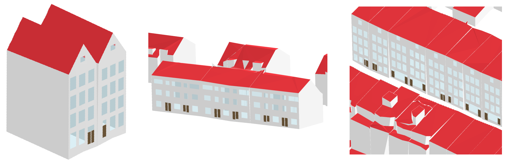

# Extraction of façade details from street-view panoramic images and integration in a 3D city model

In this repository, a method is presented to automatically enhance Level Of Detail 2 buildings in a 3D city model with window and door geometries, by using a panoramic image sequence. The figure below shows a schematic overview of the proposed method, a **three staged pipeline**. The first stage is based on identifying, rectifying and extracting the texture region of a building from a panoramic image sequence. In the next stage, the extracted façade texture images are used as input in a deep convolutional neural network for parsing façade details, such as windows and doors. In the third and final stage of the pipeline, the previously parsed window and door rectangles are aligned with the input LOD2 model to construct a LOD3 model. More on https://medium.com/@chrise96/a-deep-learning-approach-to-enhance-3d-city-models-caba7b2073d6. 


---

## Project Folder Structure

- [`stage_1`](./stage_1): Folder for the panoramic image and building analysis implementation
- [`stage_2`](./stage_2): Folder for the Faster/Mask R-CNN implementation
- [`stage_3`](./stage_3): Folder for the CityGML LOD2 to LOD3 implementation
- [`stage_1/src`](./stage_1/src): Folder for the source files specific to the stage
- [`stage_1/scripts`](./stage_1/scripts): Folder for the helper files


---

## Description of output files
- [`*.jpeg`](./stage_3/images/0363100012152551_8.426128.jpeg): Rectified façade images with the naming based on two values
    - A pand ID according to Key register Addresses and Buildings (BAG). For example: https://api.data.amsterdam.nl/bag/pand/0363100012061378/
    - A unique value, calculated using the distance in meters from the capture location of a panoramic image to the middlepoint of a façade.

- [`output_stage1.csv`](./stage_3/CSV/output_stage1.csv): A CSV file with a reference to the extracted rectified façade images. The CSV file contains the columns
    - `pand_id`: BAG pand ID.
    - `visible_point_one`: The bottom-left Rijksdriehoek coordinate of the façade (perspective of the camera/image).
    - `visible_point_two`: The bottom-right Rijksdriehoek coordinate of the façade (perspective of the camera/image).
    - `texture_filename`: The actual filename of the `*.jpeg` images.

- [`output_stage2.csv`](./stage_3/CSV/output_stage2.csv): The CSV file contains the columns
    - `bboxes_window`: A list of predicted windows, given via four pixel values: xleft, ybottom, xright, ytop.
    - `bboxes_door`:  A list of predicted doors, given via four pixel values: xleft, ybottom, xright, ytop.
    - `texture_filename`: The actual filename of the `*.jpeg` images.


---

## Datasets
### Amsterdam DataPunt
[APIs](https://api.data.amsterdam.nl/) (Open Data and internal) offered by Amsterdam Data en Informatie.

### Dataset of façade images by City of Amsterdam
For this project, the City of Amsterdam annotated over 980 segmentation mask images for training the network. Regions in Amsterdam North and West are considered with diverse architectural style buildings, to ensure the robustness and the generalization of the network. The images were manually annotated with three classes (i.e. door, window, sky) by outlining their masks and adding corresponding class labels. The dataset is split into train and val folders with two corresponding JSON files in the MS COCO format. The dataset is available here: https://drive.google.com/file/d/1Mi9cpC8Q10OVRSz13ohaBC0AYzd07u9K/view

### 3D Amsterdam
The [3D Amsterdam city model](https://3d.amsterdam.nl/) was published in 2019 as open data and contains information about every registered building in Amsterdam, as well as streets and trees. The city model consists of LOD2 style buildings in the standard CityGML or CityJSON format. It uses the Rijksdriehoek Coordinate System (EPSG:28992) and the Normaal Amsterdams Peil height system. 


---

## Windows and doors in 3D Amsterdam
A screenshot of a virtual street scene in LOD3 is given below to demonstrate the enhancement results on a street-level. Visualized with Azul CityGML viewer.



---

## Installation
1. Clone this repository:

    ```
    git clone https://github.com/chrise96/3D_building_reconstruction.git
    ```

2. Install the dependencies:

    ```
    pip install -r requirements.txt
    ```

    And install GDAL and scikit-geometry. Available as a conda package or a system install but not in pip:

    ```
    conda install -c conda-forge gdal=2.4.2
    conda install -c conda-forge scikit-geometry
    python -m pip install git+https://github.com/scikit-geometry/scikit-geometry.git
    ```


---

## Notes
- The accuracy of the GNSS/INS sensor values is an important factor that significantly affects the quality of the 
determined texture region of a building. Pose (location and orientation) optimization techniques can be used in future work to further 
improve the quality of façade texture images during the extraction process. For now, validate the quality of the extracted façade texture images, manually remove invalid ones and run:

      cd stage_1
      python3 -m scripts.filter_images
- The system treats each wall as though it is 30 meters tall. Accordingly, the visual content is partly cut off when buildings are above 30 meter. Also, the system omits buildings with an area size of 400 m2 or larger, which is calculated using the building footprint data provided by BAG. Large buildings often impose badly distorted rectification results.
- An optional step is performed on invalid CityGML files to remove duplicate buildings and keep unique ones.
- In the final stage of the pipeline, it often occurs that an opening geometry intersects with two or more exterior polygons (LOD2 wallsurface members). As interior polygons define openings in an exterior polygon, they have to be completely included in the area defined by the exterior polygon. In this case, a part of the intersecting opening geometry is simply placed over a wall surface and not propertly integrated into the building.

---
